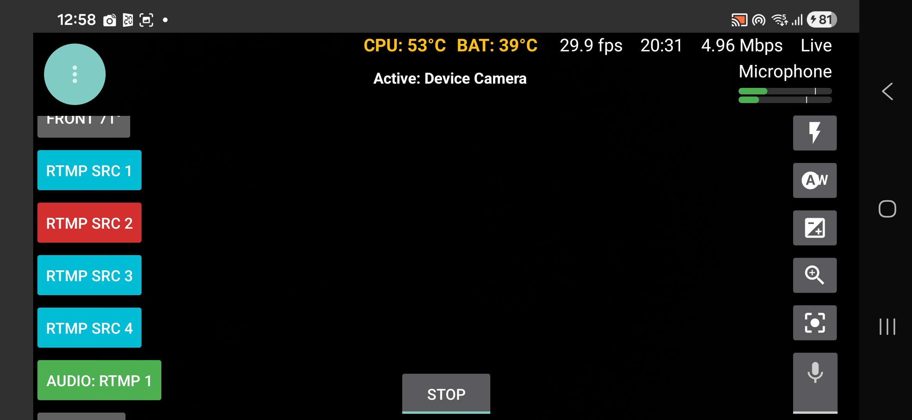
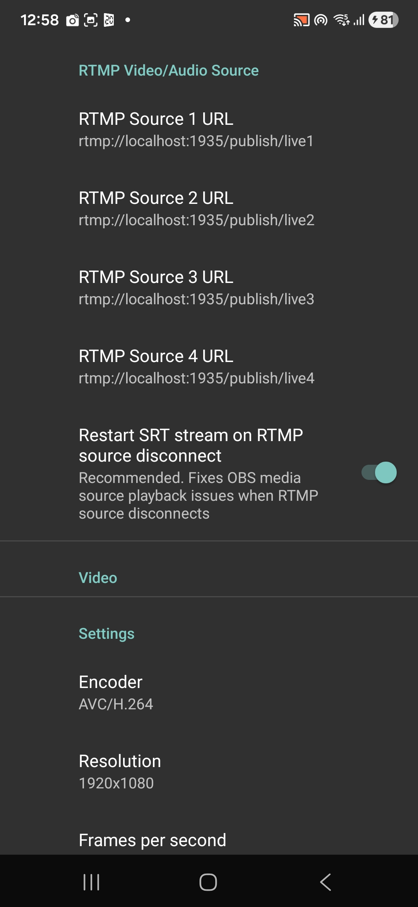

# 🚀 LifeStreamer Multitool (Swissi Edition)

**LifeStreamer Multitool** ist das ultimative Upgrade für IRL-Streamer auf Android, die Wert auf maximale Kontrolle, Stabilität und Flexibilität legen.

> [!IMPORTANT]
> Dieses Projekt basiert auf dem soliden Kern von [LifeStreamer by dimadesu](https://github.com/dimadesu/LifeStreamer). Ein riesiges Dankeschön für das ursprüngliche Fundament! ❤️

---

## 🇩🇪 Deutsch: Was ist das?

Das LifeStreamer Multitool ist mein praxisorientiertes Upgrade für echtes IRL-Streaming. Da ich selbst regelmäßig draußen streame, hatte ich genug von Black Screens und komplizierten Menüs. Dieses Tool ist **von einem Streamer für Streamer** gebaut.

### 🔥 Features der Multitool Edition
* 🔄 **Nahtloser Kamera-Wechsel:** Umschalten zwischen Quellen ohne Stream-Abbruch.
* 🎙️ **Erweitertes Audio-Routing:** Wähle deine Mikrofon-Quelle mit einem Klick auf den Audio-Button aus.
* 🛡️ **Stabilitäts-Boost:** Automatischer Fallback-Timer und Schutz vor Black Screens.
* 🧠 **Smart Source Persistence:** Automatische Wiederherstellung der Quellen nach einem Neustart.

---

## 📸 Screenshots

  
  

---

## 🎧 Audio-Routing Details

Du kannst die Audioquelle direkt in der App umschalten. Folgende Hardware wird unterstützt:

### 🎙️ Unterstützte Audio-Hardware
* **Internes Mikrofon:** Nutzt das Standard-Mikrofon deines Smartphones für den Stream.
* **Bluetooth Headsets:** Nahtlose Übertragung via Funk (z. B. AirPods, Galaxy Buds).
* **USB-C Audio-Interfaces:** Bindet professionelle Mikrofone direkt in den digitalen Stream ein.
* **Kabelgebundene Headsets (3,5mm):** Unterstützung implementiert (ungetestet – Feedback willkommen!).
* **Audio über RTMP:** Du kannst explizit auswählen, ob und wie das Audio über das RTMP-Protokoll geroutet wird.

---

## 🇺🇸 English: What is this?

LifeStreamer Multitool is my real-world upgrade for professional IRL streaming on Android. Built from real streaming experience because I was tired of camera crashes and random black screens. This tool is built **by a streamer for streamers**.

### 🔥 Multitool Edition Features
* 🔄 **Seamless Camera Switching:** Swap sources without interrupting the live stream.
* 🎙️ **Advanced Audio Routing:** Choose your microphone source with a single click on the audio button.
* 🛡️ **Stability Boost:** Automatic fallback timer and protection against black screens.
* 🧠 **Smart Source Persistence:** Automatically restore your sources after a restart.

### 🎧 Audio-Routing Details (English)
* **Internal Microphone:** Uses your smartphone's built-in microphone for the stream.
* **Bluetooth Headsets:** Seamless transmission via wireless (e.g., AirPods, Galaxy Buds).
* **USB-C Audio Interfaces:** Integrate professional microphones directly into the digital stream.
* **Wired Headsets (3.5mm):** Support implemented (untested – feedback welcome!).
* **Audio via RTMP:** You can explicitly choose if and how the audio is routed via the RTMP protocol.

---

## 🛠 Setup & Installation

### 🇩🇪 Deutsch
1. Lade die aktuelle APK unter [**Releases**](https://github.com/powerswissi/LifeStreamerMultitool/releases) herunter.
2. Installiere die Datei auf deinem Android-Gerät.
3. **WICHTIG:** Du benötigst zwingend diese beiden Komponenten, sonst funktioniert die App nicht:
    * [**MediaSrvr**](https://github.com/dimadesu/MediaSrvr)
    * [**Bond Bunny**](https://github.com/dimadesu/bond-bunny)

### 🇺🇸 English
1. Download the latest APK from [**Releases**](https://github.com/powerswissi/LifeStreamerMultitool/releases).
2. Install the file on your Android device.
3. **IMPORTANT:** You absolutely need these two components, otherwise the app will not function:
    * [**MediaSrvr**](https://github.com/dimadesu/MediaSrvr)
    * [**Bond Bunny**](https://github.com/dimadesu/bond-bunny)

---

## 🤝 Credits & Original Project
Dieses Multitool wäre ohne die Vorarbeit von **dimadesu** nicht möglich:
* **Original App:** [LifeStreamer](https://github.com/dimadesu/LifeStreamer)
* **Core Components:** [MediaSrvr](https://github.com/dimadesu/MediaSrvr) & [Bond Bunny](https://github.com/dimadesu/bond-bunny)

---

## ⚖️ License
Dieses Projekt steht unter der **GPL-3.0 License**. Siehe [LICENSE.txt](LICENSE.txt) für Details.